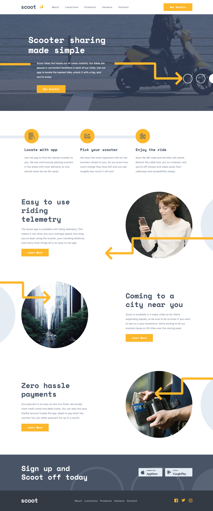

<<<<<<< HEAD
# Scoot-website
=======
<a name="readme-top"></a>

# Frontend Mentor - Scoot website

## Table of contents

- [Overview](#overview)
  - [Built with](#built-with)
  - [Screenshot](#screenshot)
- [My process](#my-process)
  - [What I learned](#what-i-learned)
  - [Useful resources](#useful-resources)

## Overview

Users should be able to:

- View the optimal layout for each page depending on their device's screen size
- See hover states for all interactive elements throughout the site
- Switch between light and dark theme

### Built with


<br>

### Screenshot

<br>



<br>
<br>

## My process

<br>
<br>

### What I learned

<br>

**_1. How to use React Router_**

I explored the documentation of React Router in order to create a seamless web application with the ability to navigate between pages without the need for page refresh.

While the documentation was well-written, I encountered some issues in my application that didn't behave as expected. To overcome these challenges, I resorted to watching YouTube tutorials and reading articles to achieve the desired outcome. Many of the articles and some of the YouTube videos focused on React Router v5, which initially confused me. However, as I researched deeper, everything began to make more sense.

There are two ways we can create Browser Routes:

**_A.With the object approach, the one that this project was built with_**

```js
const router = createBrowserRouter([
  {
    path: '/',
    element: <App />,
    children: [
      {
        path: 'about',
        element: <About />,
      },
      {
        path: 'locations',
        element: <Location />,
      },
    ],
  },
]);
```

**_B. If you prefer to create your Routes as JSX instead of objects, you can do that with the help of 'createRoutesFromElements'_**

```js
const router = createBrowserRouter(
  createRoutesFromElements(
    <Route path="/" element={<App />}>
      <Route path="about" element={<About />} />
      <Route path="dashboard" element={<Dashboard />} />
    </Route>
  )
);
```

<br>

**_2. Building reusable components to reduce the number of files needed_**

<br>

**_3. How to use the Framer Motion Library to add animation into my project_**

<br>

**_4.How to use the Theme Provider from styled components to enable theme switching_**

First you need to wrap all the components that are going to be needing the theming support, just wrap the top parent element and all children are going to have access to the Theme Provider as well.

In my project I created two objects _light_ and _dark_, that is where I saved the colors for each theme.

Example:

```js
const light = {
  name: 'light-theme',
  colors: {
    body: '#fff',
    primary: '#FCB72B',
    background: '#E5ECF4',
  },
};

const dark = {
  name: 'dark-theme',
  colors: {
    body: '#001E3D',
    primary: '#46C2CB',
    background: '#21325E',
  },
};
```

Then you need to wrap your App with the Theme Provide, but you need to provide a theme attribute which is the one initially applied.

```js
<ThemeProvider theme={light}>
  <App />
</ThemeProvider>
```

<br>
<br>

### Useful resources

<br>

- [Styled components Docs](https://styled-components.com/) - Getting familiar with the documentation of styled components. <br>
- [Build a React theme switcher app with styled-components](https://blog.logrocket.com/build-react-theme-switcher-app-styled-components/) - This step by step guide helped me implement my theme switcher function and understand how it works. <br>
- [React router Docs](https://reactrouter.com/en/main) - Getting familiar with the documentation of react router. There are so many outdated reasources online, where most of the features are deprecated <br>
- [How to Deploy Your Vite React App to GitHub Pages](https://blog.devgenius.io/how-to-deploy-your-vite-react-app-to-github-pages-with-and-without-react-router-b060d912b10e) - I had troubles uploading my project on Github, since this was the first time I used the react router, and there were some additional configuration to be taken into account. This was a very useful article that helped upload my project properly. <br>
- [Framer motion Docs](https://www.framer.com/motion/) - Getting familiar with the documentation of Framer motion to apply cool animations and interactions to your website.<br>

<p align="right">(<a href="#readme-top">back to top</a>)</p>
>>>>>>> a1ef615 (Initial commit)
